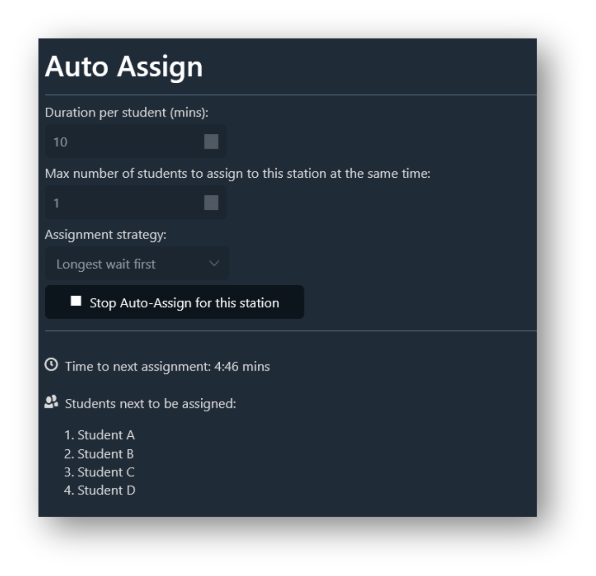
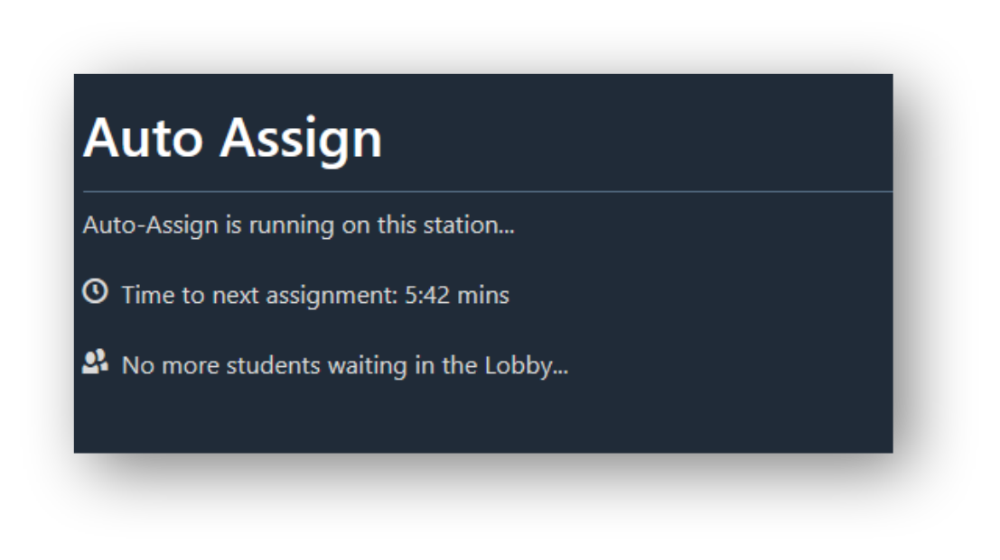

# Edrys Auto-Assign Module

This module allows you to automatically assign students to stations, instead of having to manually drag students in and out. It will pick students from the Lobby and return them one by one into the station at a specified interval.

What teachers see:
<div align="center">

</div>


What students in the station see (to let them know how much time remaining they have):
<div align="center">

</div>

## Usage

Simply use this URL to add the module to your class:

```
https://edrys-org.github.io/module-auto-assign/
```

The module is fully configurable using the UI by any teacher in the class, on a per-station basis.

## Implementation details

This module works in a distributed way, where each station picks its own students at the specified interval. If you have more than one station, as they don't communicate with each other, the module relies on differences in time interval offsets to avoid any conflicts where the same student might get picked twice. In the future, inter-station comms maybe implemented to allow calcualting the exact time a student will get access and display that to every waiting student.
